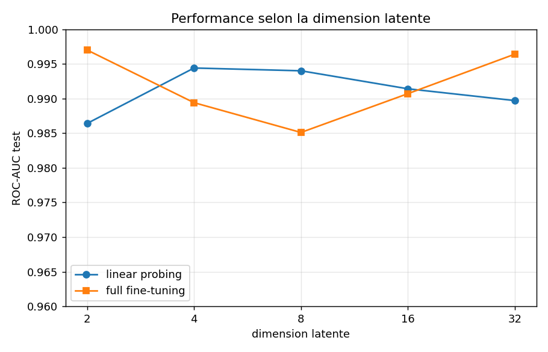
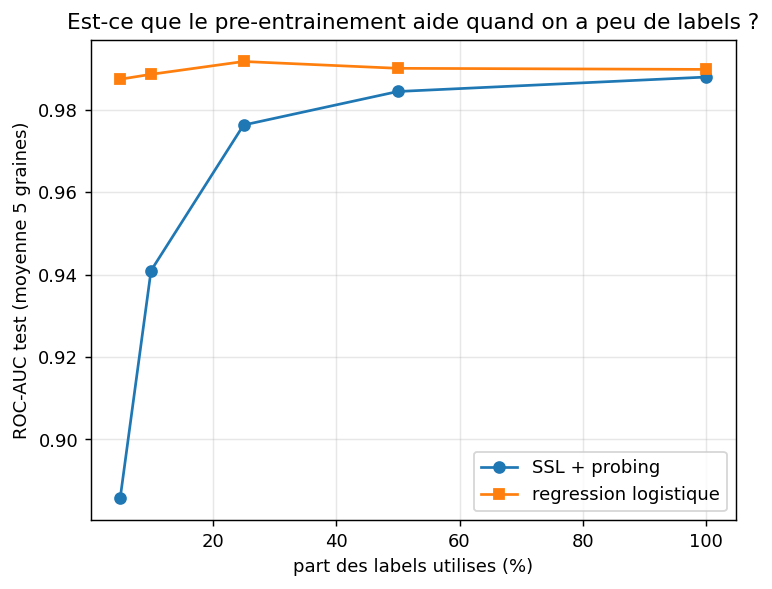
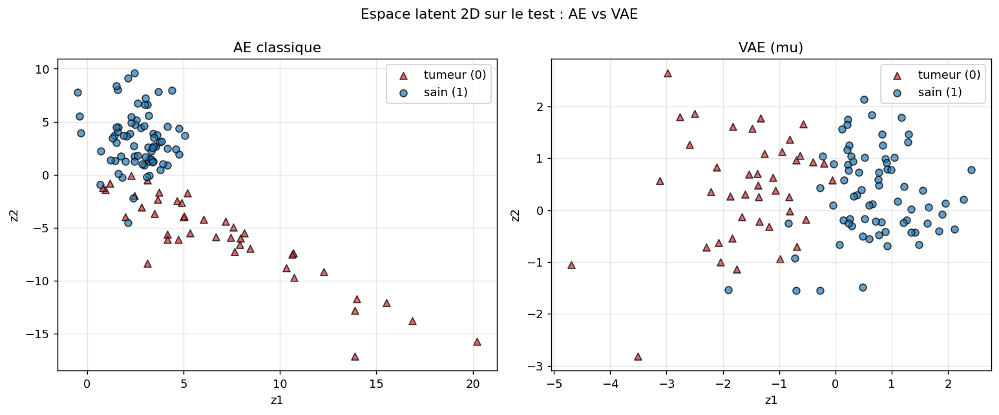

# Encodeurs et auto-encodeurs : explorer leurs usages pour l'inférence

> **En bref.** Projet d'apprentissage personnel : j'explore différentes façons de se servir d'un
> auto-encodeur pour l'inférence, comparées à des baselines supervisées (détection d'anomalies,
> pré-entraînement auto-supervisé, VAE), avec des expériences de robustesse, d'efficacité en
> labels et d'ablation. Je rejoue le même protocole sur deux jeux de données : Breast Cancer
> Wisconsin (tabulaire, facile, quasi linéairement séparable), puis Fashion-MNIST restreint à
> T-shirt/top vs Shirt (image, beaucoup plus dur), pour voir si mes conclusions sur un dataset
> facile tiennent sur un dataset plus difficile.

**Notions abordées.** Encodeur / décodeur, auto-encodeur, espace latent et compression ;
détection d'anomalies par erreur de reconstruction et choix de seuil (non supervisé vs calibré) ;
apprentissage auto-supervisé (SSL), pré-entraînement, linear probing, full fine-tuning, effet de
la dimension latente ; baselines supervisées (régression logistique, random forest), grid search
et validation croisée ; métriques (ROC-AUC, PR-AUC, F1) ; reproductibilité (graines aléatoires),
robustesse multi-graines, courbe d'efficacité en labels, ablation du pré-entraînement ;
auto-encodeur variationnel (VAE), terme KL et espace latent régularisé.

## Deux jeux de données, même protocole

- **Breast Cancer Wisconsin** : notebooks `01` à `05` à la racine du repo. 569 patients, 30
  variables numériques, étiquette binaire (tumeur maligne / tissu sain). Petit, propre, déjà
  quasi linéairement séparable.
- **Fashion-MNIST, T-shirt/top vs Shirt** : mêmes 5 notebooks, mêmes seeds, même méthodologie,
  dans [`fashion_mnist/`](fashion_mnist/). 14 000 images 28×28 (784 pixels), limitées aux deux
  classes les plus visuellement confondues du dataset, pour avoir un vrai problème binaire non
  linéaire (une régression logistique sur pixels bruts plafonne à 0,93 de ROC-AUC, contre 0,993
  sur le cancer). Le détail complet, les adaptations d'architecture et toutes les figures sont
  dans [`fashion_mnist/README.md`](fashion_mnist/README.md) ; ce fichier-ci n'en donne qu'un
  résumé plus bas.

## Résumé des résultats

### Breast Cancer Wisconsin (facile)

| Notebook | Ce que j'explore | Résultat clé (ROC-AUC test) |
|---|---|---|
| `01` | Détection d'anomalies : auto-encodeur entraîné sur les sains, erreur de reconstruction comme score, deux façons de fixer le seuil | ~0,96 **sans aucun label d'anomalie** |
| `02` | SSL : pré-entraînement, puis linear probing (encodeur gelé) et full fine-tuning ; effet de la dimension latente | probing **0,986**, full-FT **0,997** ; agrandir le latent n'aide pas ici |
| `03` | Baselines supervisées, réglées par grid search + validation croisée | régression logistique **0,993**, random forest **0,997** |
| `04` | Expériences : stabilité multi-graines, efficacité en labels, ablation | résultats stables ; logreg > SSL à peu de labels ; pré-entraînement **0,988** vs encodeur aléatoire **0,686** |
| `05` | VAE : espace latent régularisé (terme KL), comparé à l'AE classique | latent plus compact ; perf prédictive quasi identique à l'AE (~**0,99**) |

### Fashion-MNIST, T-shirt/top vs Shirt (plus dur)

| Notebook | Ce que j'explore | Résultat clé (ROC-AUC test) |
|---|---|---|
| `01` | Même protocole, AE entraîné sur T-shirt/top, Shirt = anomalie | **0,792**, une anomalie visuellement proche est bien plus dure à détecter |
| `02` | SSL : probing vs full fine-tuning ; effet de la dimension latente | probing **0,867 → 0,931** selon le latent (2 à 16) ; full-FT stable **~0,94** |
| `03` | Baselines supervisées sur pixels bruts | régression logistique **0,928**, random forest **0,945** |
| `04` | Stabilité, efficacité en labels, ablation | stable (±0,004) ; logreg > probing à latent fixe (2) à tous les niveaux de labels ; pré-entraîné **0,864** vs aléatoire **0,598** |
| `05` | VAE vs AE classique | performances quasi identiques (probing **0,870** vs **0,869**) |

**À retenir en une phrase, pour chacun :**

- *Cancer (facile)* : une représentation apprise sans étiquette est déjà presque linéairement
  séparable, le full fine-tuning égale la meilleure baseline, mais le pré-entraînement ne dépasse
  pas une simple régression logistique. Son intérêt se verrait sur des données plus complexes.
- *Fashion-MNIST (dur)* : cette fois le full fine-tuning dépasse nettement la régression
  logistique (0,94 contre 0,93). L'avantage prédit à la fin du premier passage apparaît donc bien,
  mais seulement si l'encodeur a assez de capacité latente ou la liberté de se réajuster : un
  encodeur gelé trop étroit (latent 2) reste derrière la baseline, quel que soit le nombre de
  labels.

---

## L'idée de départ

Un auto-encodeur apprend à compresser puis reconstruire des données sans étiquettes. Une fois
cet apprentissage fait, qu'est-ce qu'on peut en tirer pour prédire ? J'ai exploré trois réponses
et je les ai systématiquement comparées à une baseline supervisée. Ce n'est pas un projet de
recherche : le but est de manipuler ces idées moi-même et de garder une trace claire de ce que
chacune donne. Je commence par un dataset facile, puis je teste si les conclusions tiennent sur
un dataset plus dur.

Le terrain de la première passe est le jeu de données Breast Cancer Wisconsin (scikit-learn) :
569 patients, 30 mesures numériques, étiquette binaire (tumeur maligne ou tissu bénin). Petit,
propre et déjà bien séparable, il permet de comparer des méthodes sans se perdre dans le
nettoyage. Détail utile : dans scikit-learn la classe 0 est la tumeur et la classe 1 le tissu
sain ; pour la détection d'anomalies j'ai inversé cette convention pour raisonner en « normal »
vs « anormal ».

## 1. L'auto-encodeur pour détecter des anomalies

J'entraîne l'auto-encodeur uniquement sur des patients sains, à seule fin de bien les
reconstruire. L'intuition : un modèle qui n'a vu que du « normal » reconstruit mal une tumeur
qu'il n'a jamais rencontrée. L'erreur de reconstruction devient alors un score d'anomalie.

Ça marche : sur le test, l'erreur moyenne vaut ~0,6 pour les sains contre plus de 7 pour les
tumeurs, et le score seul (sans seuil) donne un ROC-AUC autour de 0,96. Le latent étant en
dimension 2, on peut aussi visualiser la séparation des deux groupes.

Pour passer du score à une décision, je compare deux seuils : un seuil non supervisé (95e
percentile des erreurs sur les sains, soit ~5 % de fausses alertes tolérées) et un seuil calibré
sur une petite validation (maximisation du F1). Le seuil calibré fait un peu mieux (F1 ~0,90 vs
~0,88), ce qui est logique puisqu'il utilise un peu d'information supervisée.

## 2. L'auto-encodeur comme pré-entraînement, puis fine-tuning

Ici l'auto-encodeur sert de pré-entraînement auto-supervisé : l'encodeur apprend une
représentation en reconstruisant les données sans étiquettes, puis je le réutilise pour classer,
de deux façons. En *linear probing*, je gèle l'encodeur et n'entraîne qu'une petite tête
(quelques dizaines de paramètres) : ça mesure la qualité brute de la représentation. En *full
fine-tuning*, je repars des mêmes poids mais laisse tout le réseau s'adapter.

Le probing atteint déjà 0,986 de ROC-AUC avec l'encodeur figé : la représentation apprise sans
labels est donc presque linéairement séparable. Le full fine-tuning monte à 0,997 (F1 0,981) en
spécialisant tout le réseau pour la tâche, au prix d'un entraînement complet plutôt que d'une
poignée de paramètres.

J'ai ensuite fait varier la dimension latente (2, 4, 8, 16, 32), en m'attendant à ce qu'un
espace plus grand aide. Ce n'est pas le cas.

| dimension latente | probing ROC-AUC | probing F1 | full-FT ROC-AUC | full-FT F1 |
|---:|---:|---:|---:|---:|
| 2  | 0.986 | 0.953 | 0.997 | 0.981 |
| 4  | 0.994 | 0.944 | 0.989 | 0.981 |
| 8  | 0.994 | 0.953 | 0.985 | 0.972 |
| 16 | 0.991 | 0.915 | 0.991 | 0.972 |
| 32 | 0.990 | 0.953 | 0.996 | 0.972 |

Tout reste sur un plateau autour de 0,98–0,99 ; les variations ressemblent à du bruit. Dès la
dimension 2, la représentation est déjà proche du plafond : sur un dataset facile, la dimension
latente n'est pas le levier qui compte. (Sur Fashion-MNIST, ce n'est plus vrai du tout, voir plus
bas.)

## 3. Les baselines supervisées

Pour situer honnêtement les approches précédentes, je prends deux modèles supervisés classiques,
réglés par grid search en validation croisée : une régression logistique (0,993 de ROC-AUC) et
une random forest (0,997). Sur des données tabulaires comme celles-ci, ils sont durs à battre.

## Résultats côte à côte (Breast Cancer Wisconsin)

Valeurs sur le jeu de test (20 % des données, mis de côté avant tout entraînement). Le ROC-AUC
est ma métrique principale car il ne dépend pas du seuil.

| Approche | ROC-AUC | F1 (macro) |
|---|---:|---:|
| Random Forest (baseline supervisée) | 0.997 | 0.954 |
| SSL + full fine-tuning | 0.997 | 0.981 |
| Régression logistique (baseline supervisée) | 0.993 | 0.953 |
| SSL + linear probing | 0.986 | 0.953 |
| Auto-encodeur (détection d'anomalie) | ~0.96 | ~0.90 |

Chaque méthode se classe selon l'information dont elle dispose : les baselines supervisées voient
tous les labels et restent la référence, le SSL + fine-tuning les rejoint, et la détection
d'anomalies reste en dessous mais sans avoir vu un seul exemple de tumeur.

## Expériences complémentaires (Breast Cancer Wisconsin)

Un quatrième notebook va au-delà du « ça marche » et teste trois hypothèses. C'est la partie où
j'ai le plus appris, notamment parce que les résultats surprennent.

**Stabilité.** Sur cinq graines aléatoires, les scores bougent très peu (probing 0,988 ± 0,008,
full-FT 0,995 ± 0,008) : les écarts observés ne sont pas des coups de chance.

**Efficacité en labels.** J'entraîne le classifieur sur une fraction seulement des labels, et je
compare le SSL + probing à une régression logistique sur les mêmes données.

| part des labels | SSL + probing (ROC-AUC) | régression logistique (ROC-AUC) |
|---:|---:|---:|
| 5 %   | 0.886 | 0.987 |
| 10 %  | 0.941 | 0.989 |
| 25 %  | 0.976 | 0.992 |
| 50 %  | 0.984 | 0.990 |
| 100 % | 0.988 | 0.990 |

Contre toute attente, la régression logistique domine, surtout à peu de labels (0,987 dès 5 %
contre 0,886 pour le probing). Deux raisons : les 30 variables brutes sont déjà quasi
linéairement séparables, et l'encodeur compresse à 2 dimensions, ce qui jette de l'information.
Sur un dataset aussi facile, le pré-entraînement n'apporte pas l'avantage attendu en faible
régime de labels — cet avantage se verrait sur des données où les variables brutes ne suffisent
pas.

**Le pré-entraînement sert-il vraiment ?** Oui : le même probing sur un encodeur aux poids
aléatoires chute à 0,686 (et devient très instable, ± 0,20) contre 0,988 pour l'encodeur
pré-entraîné. Le pré-entraînement apporte donc énormément par rapport à « rien » — il ne suffit
juste pas à battre une bonne baseline supervisée sur ce cas facile.

## Un auto-encodeur variationnel (VAE) pour finir

Dernier essai : remplacer l'auto-encodeur par un VAE, qui ajoute à la reconstruction un terme
KL poussant l'espace latent vers une gaussienne centrée réduite. Je voulais surtout voir la
différence de *construction* de l'espace latent, et vérifier si cette régularisation change la
performance.

Côté espace latent, la différence est visible : le nuage du VAE est plus compact et centré
autour de l'origine, là où celui de l'AE classique s'étale librement. Le VAE « range » son
espace, c'est exactement l'effet du terme KL. Côté performance prédictive, en revanche, les deux
se tiennent de très près : linear probing à 0,990 de ROC-AUC pour le VAE contre 0,989 pour l'AE,
et full fine-tuning à 0,999 contre 0,997. Autrement dit, la régularisation du VAE donne un espace
plus propre sans rien coûter (ni rien apporter) à la classification sur ce dataset. Son vrai
intérêt est ailleurs — un latent structuré, la génération — plus que dans la prédiction pure.

## Ce que je retiens (Breast Cancer Wisconsin)

Une représentation apprise sans étiquette peut être étonnamment bonne, le full fine-tuning
égale le meilleur modèle supervisé, et garder une baseline sous la main est indispensable pour
juger de la qualité réelle. J'ai aussi vu, en le testant, que sur un problème facile augmenter
la capacité (dimension latente) ou pré-entraîner n'apporte pas toujours ce qu'on croit :
l'intérêt du SSL apparaît sur des données plus complexes, pas sur un cas aussi simple. C'est
exactement cette hypothèse que le second passage, sur Fashion-MNIST, met à l'épreuve.

---

## Deuxième passage : Fashion-MNIST, la même exploration sur un dataset plus dur

Mêmes 5 notebooks, même méthodologie (seeds, découpages, métriques), mais rejoués sur
Fashion-MNIST, limité à deux classes visuellement proches : **T-shirt/top** (la classe « normale »
pour la détection d'anomalies) et **Shirt** (la classe la plus souvent confondue avec T-shirt/top
dans ce dataset). Le but est d'avoir un problème binaire réellement non linéaire, plutôt que de
retomber sur un cas facile. Seules l'architecture (encodeur/décodeur mis à l'échelle pour 784
pixels : `784 → 256 → 64 → latent`) et la taille de batch (128 au lieu de 64) sont adaptées ; le
reste est identique. Le détail complet, les adaptations et toutes les figures sont dans
[`fashion_mnist/README.md`](fashion_mnist/README.md).

**Anomalies (01).** L'anomalie (Shirt) ressemble bien plus au normal (T-shirt/top) qu'une tumeur
à un tissu sain : ROC-AUC 0,792 contre 0,96 sur le cancer. Fait notable : sur ce test déséquilibré
(77 % d'anomalies), le seuil « calibré » par F1 dégénère vers une règle triviale (tout classer en
anomalie). C'est un piège resté invisible sur le cancer, où le déséquilibre était plus modéré.

**SSL et dimension latente (02).** Contrairement au cancer, la dimension latente compte
vraiment : le linear probing grimpe de 0,867 (latent 2) à 0,931 (latent 16) puis plafonne, alors
que le full fine-tuning reste stable autour de 0,94 quel que soit le latent, parce qu'il compense
un goulot étroit en se réajustant, là où le probing en dépend directement.

**Baselines (03).** Sur pixels bruts, sans aucune notion de structure d'image, les baselines
sont nettement moins solides que sur le cancer : régression logistique 0,928, random forest
0,945. C'est ce qui laisse de la place au pré-entraînement : le full fine-tuning (~0,94) dépasse
la régression logistique et rejoint quasiment la random forest, ce qui n'arrivait jamais sur le
cancer.

**Expériences complémentaires (04).** Résultats stables sur 5 graines. À latent fixé à 2 (comme
dans l'étude originale), la régression logistique bat le SSL + probing à *toutes* les fractions
de labels. En apparence c'est le même résultat surprenant que sur le cancer, mais pour une raison
différente : le notebook 02 montre que latent 2 est justement le pire réglage pour le probing. La
vraie leçon n'est pas « le pré-entraînement ne sert à rien en faible régime de labels » mais « un
encodeur gelé trop étroit ne sert à rien, quel que soit le nombre de labels ». L'ablation confirme
que le pré-entraînement lui-même apporte beaucoup : encodeur aléatoire à 0,598 ± 0,041 contre
0,864 ± 0,004 pré-entraîné (écart +0,267, du même ordre que sur le cancer).

**VAE (05).** Comme sur le cancer, VAE et AE classique se tiennent de très près en performance
(probing 0,870 vs 0,869) ; le nuage latent du VAE est un peu plus resserré mais moins nettement
qu'espéré, sans doute parce que les deux classes se chevauchent déjà trop pour que le terme KL
« range » beaucoup plus. Cette conclusion-là ne change pas avec un dataset plus dur.

## Ce que je retiens, une fois les deux passages comparés

L'hypothèse formulée à la fin du premier passage, comme quoi l'intérêt du SSL apparaîtrait sur
des données plus complexes, se confirme, mais avec une nuance qu'un seul dataset facile ne
pouvait pas montrer. Sur Fashion-MNIST, le full fine-tuning dépasse bien la régression logistique
(0,94 contre 0,93), ce qu'il ne faisait pas sur le cancer. Mais cet avantage dépend de la
capacité de l'encodeur : figé à une dimension latente de 2 (le réglage par défaut repris du
premier passage), le probing reste derrière la baseline à tous les niveaux de labels. Il faut
soit élargir le latent (16 ou plus), soit dégeler l'encodeur, pour que le pré-entraînement paie.
Sur le cancer, cette distinction ne se voyait pas parce que la dimension latente n'avait presque
aucun effet. C'était justement la conclusion à tester, et Fashion-MNIST la contredit clairement.

En comparant les deux passages, deux autres choses ressortent. D'abord, la détection d'anomalies
par reconstruction dépend beaucoup de la proximité entre la classe normale et l'anomalie (0,96
contre 0,79 de ROC-AUC selon qu'il s'agit d'une tumeur ou d'un vêtement visuellement proche).
Ensuite, le choix du seuil est plus fragile qu'il n'y paraît sur un jeu déséquilibré : maximiser
le F1 en validation peut dégénérer vers une règle triviale, un piège resté invisible tant que je
n'avais testé qu'un seul dataset plus équilibré.

Les limites font partie de l'exercice : architectures volontairement simples, un seul dataset
« dur » testé, une seule paire de classes retenue sur les 45 possibles dans Fashion-MNIST. Le
prolongement qui m'intéresse le plus serait de reprendre ces approches sur des données
déséquilibrées à l'échelle réelle (fraude, intrusion réseau), là où la détection d'anomalies
comme le pré-entraînement prendraient encore plus de sens.
