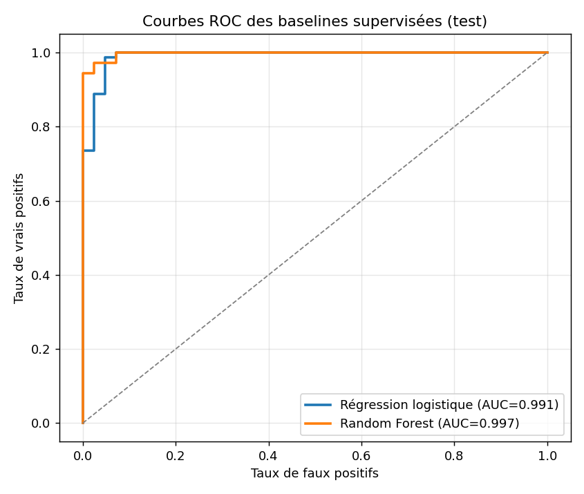

# Encodeurs et auto-encodeurs : explorer leurs usages pour l'inférence

> Projet d'apprentissage personnel : j'explore comment se servir d'un auto-encodeur
> pour faire des prédictions, en comparant trois approches à des baselines supervisées sur un même
> jeu de données tabulaire (Breast Cancer Wisconsin). Le tout accompagné d'expériences de
> robustesse, d'efficacité en labels et d'ablation.

**Notions abordées.** Encodeur / décodeur, auto-encodeur, espace latent et compression ;
détection d'anomalies par erreur de reconstruction et choix de seuil (non supervisé vs calibré) ;
apprentissage auto-supervisé (SSL), pré-entraînement, linear probing, full fine-tuning, effet de
la dimension latente ; baselines supervisées (régression logistique, random forest), grid search
et validation croisée ; métriques (ROC-AUC, PR-AUC, F1) ; reproductibilité (graines aléatoires),
robustesse multi-graines, courbe d'efficacité en labels, et ablation du pré-entraînement.

**Contenu du dépôt (4 notebooks).**

1. `01` — détection d'anomalies avec un auto-encodeur (erreur de reconstruction + seuils)
2. `02` — SSL : pré-entraînement, puis linear probing et full fine-tuning, + effet de la dimension latente
3. `03` — baselines supervisées (régression logistique, random forest)
4. `04` — expériences : stabilité multi-graines, efficacité en labels, ablation du pré-entraînement

**Résultats en un coup d'œil.** Les baselines supervisées et le SSL + full fine-tuning atteignent
0,99+ de ROC-AUC ; le linear probing sur encodeur gelé suit de près (0,986) ; la détection
d'anomalies non supervisée reste en dessous (~0,96) mais sans aucun label d'anomalie. Deux
constats plus fins : augmenter la dimension latente n'aide pas sur ce dataset facile, et le
pré-entraînement bat largement un encodeur aléatoire (0,988 vs 0,686) sans pour autant dépasser
une simple régression logistique quand les données sont déjà faciles à séparer.

---

Ce dépôt est un compte rendu personnel. Je l'ai monté pour apprendre, en pratiquant, comment
on se sert d'un encodeur une fois qu'il a appris à représenter des données — et surtout quelles
sont les différentes manières de l'utiliser au moment de faire des prédictions. Ce n'est pas
une contribution de recherche et ce n'est pas censé l'être : l'objectif est de manipuler ces
idées moi-même, de les comparer proprement sur un même jeu de données, et de garder une trace
claire de ce que chacune donne.

L'idée de départ tient en une question. Un auto-encodeur apprend à compresser puis reconstruire
des données sans avoir besoin d'étiquettes. Une fois cet apprentissage fait, qu'est-ce qu'on
peut réellement en tirer pour prédire quelque chose ? J'ai exploré trois réponses, et je les ai
systématiquement confrontées à une baseline supervisée classique pour garder les pieds sur
terre.

## Le terrain d'expérience

J'ai tout fait sur le jeu de données Breast Cancer Wisconsin (inclus dans scikit-learn) : 569
patients, 30 mesures numériques chacun, et une étiquette binaire — tumeur maligne ou tissu
bénin. Je l'ai choisi parce qu'il est petit, propre et déjà bien séparable : ça me permettait
de comparer des méthodes sans passer mon temps sur le nettoyage, et de me concentrer sur ce que
je voulais vraiment comprendre. Un détail qui a son importance : dans scikit-learn, la classe 0
est la tumeur et la classe 1 le tissu sain. Pour la partie détection d'anomalies, j'ai inversé
cette convention afin de raisonner en « normal » contre « anormal ».

## Ce que j'ai mis en place

### 1. L'auto-encodeur seul, pour détecter des anomalies

La première approche n'utilise aucune étiquette de tumeur. J'entraîne l'auto-encodeur
uniquement sur des patients sains, à seule fin de bien les reconstruire. L'intuition : un modèle
qui n'a jamais vu que du « normal » devrait reconstruire fidèlement un profil sain, mais se
tromper davantage sur une tumeur qu'il n'a jamais rencontrée. L'erreur de reconstruction
devient alors un score d'anomalie.

Concrètement, ça marche : sur le jeu de test, l'erreur moyenne de reconstruction est d'environ
0,6 pour les patients sains contre plus de 7 pour les tumeurs — un écart très net. En regardant
uniquement ce score, sans jamais fixer de seuil, on obtient un ROC-AUC autour de 0,96. Comme la
dimension de l'espace latent est réduite à 2, j'ai aussi pu visualiser cet espace : les sains et
les tumeurs s'y séparent visiblement.

Reste à transformer ce score continu en décision. J'ai comparé deux façons de choisir le seuil,
qui correspondent à deux situations réelles. La première est entièrement non supervisée : je
prends le 95e percentile des erreurs observées sur les patients sains, ce qui revient à tolérer
environ 5 % de fausses alertes. La seconde suppose qu'on dispose de quelques exemples étiquetés
et cherche le seuil qui maximise le F1 sur une petite validation. Le seuil calibré fait un peu
mieux (F1 autour de 0,90 contre 0,88 pour le seuil non supervisé), ce qui est logique puisqu'il
s'appuie sur un peu d'information supervisée.

### 2. L'auto-encodeur comme pré-entraînement, puis fine-tuning

La deuxième approche change complètement d'usage. Ici l'auto-encodeur ne sert pas à prédire
directement : il sert de pré-entraînement auto-supervisé. L'encodeur apprend d'abord une
représentation en reconstruisant les données, sans étiquettes, puis je réutilise cet encodeur
pour une tâche de classification. J'ai testé les deux façons classiques de faire ça.

En *linear probing*, je gèle complètement l'encodeur et je n'entraîne qu'une petite tête de
classification par-dessus — quelques dizaines de paramètres seulement. Ça mesure la qualité
brute de la représentation apprise sans labels. En *full fine-tuning*, je repars des mêmes
poids pré-entraînés mais je laisse tout le réseau s'adapter à la tâche.

Le résultat qui m'a le plus marqué vient du linear probing : avec l'encodeur totalement figé, une
simple tête atteint déjà 0,986 de ROC-AUC. Autrement dit, la représentation apprise sans la
moindre étiquette est déjà presque linéairement séparable. Le full fine-tuning va plus loin et
atteint 0,997 de ROC-AUC avec un F1 de 0,981 : en dégelant tout le réseau, on le spécialise
pour la classification au lieu de se contenter de ce qu'il avait appris en reconstruisant. Le
prix à payer, c'est qu'on ré-entraîne l'ensemble du réseau plutôt qu'une poignée de paramètres.

J'ai ensuite regardé l'effet de la taille de l'espace latent, en refaisant tout le pipeline
pour des dimensions de 2, 4, 8, 16 et 32. Mon attente naïve était qu'un espace plus grand
donnerait de meilleures performances. Ce n'est pas ce que j'ai observé.

| dimension latente | probing ROC-AUC | probing F1 | full-FT ROC-AUC | full-FT F1 |
|---:|---:|---:|---:|---:|
| 2  | 0.986 | 0.953 | 0.997 | 0.981 |
| 4  | 0.994 | 0.944 | 0.989 | 0.981 |
| 8  | 0.994 | 0.953 | 0.985 | 0.972 |
| 16 | 0.991 | 0.915 | 0.991 | 0.972 |
| 32 | 0.990 | 0.953 | 0.996 | 0.972 |

Tout reste sur un plateau autour de 0,98–0,99, et les petites variations d'une dimension à
l'autre ressemblent davantage à du bruit d'entraînement qu'à une vraie tendance. L'explication
que j'en tire : dès la dimension 2, la représentation est si proche du plafond que la marge de
progression est quasi nulle. Sur un jeu de données facile, où les classes sont largement
séparables même dans un espace très compressé, la dimension latente n'est tout simplement pas
le levier qui compte.

### 3. La baseline supervisée

Pour situer honnêtement les deux approches précédentes, il me fallait un point de comparaison
solide : des modèles supervisés classiques, entraînés directement sur les étiquettes. J'ai pris
une régression logistique et une random forest, toutes deux réglées par recherche
d'hyperparamètres en validation croisée. Sur ce type de données tabulaires, ce sont des modèles
difficiles à battre, et ça s'est confirmé : la random forest atteint 0,997 de ROC-AUC, la
régression logistique 0,993.

## Les résultats côte à côte

Toutes les valeurs sont mesurées sur le jeu de test (20 % des données, mis de côté avant tout
entraînement). Le ROC-AUC est ma métrique principale parce qu'il ne dépend pas du choix d'un
seuil.

| Approche | ROC-AUC | F1 (macro) |
|---|---:|---:|
| Random Forest (baseline supervisée) | 0.997 | 0.954 |
| SSL + full fine-tuning | 0.997 | 0.981 |
| Régression logistique (baseline supervisée) | 0.993 | 0.953 |
| SSL + linear probing | 0.986 | 0.953 |
| Auto-encodeur (détection d'anomalie) | ~0.96 | ~0.90 |

La lecture d'ensemble est cohérente avec l'information dont dispose chaque méthode. Les
baselines supervisées, qui voient tous les labels, restent la référence. Le pré-entraînement
suivi d'un fine-tuning les rejoint complètement, ce qui montre qu'une bonne partie du travail
peut se faire sans étiquettes. La détection d'anomalies reste en dessous, mais dans le bon ordre
de grandeur — et c'est la seule méthode qui n'a eu besoin d'aucun exemple de tumeur pour
fonctionner. Chaque approche paie, en somme, le prix de l'information dont elle se prive.

## Expériences complémentaires

Une fois les trois approches en place, j'ai voulu aller un cran plus loin que « ça marche » et
tester quelques hypothèses. C'est l'objet d'un quatrième notebook, et c'est aussi la partie où
j'ai le plus appris — notamment parce que les résultats ne sont pas ceux que j'attendais.

D'abord la **stabilité** : en rejouant tout le pipeline sur cinq graines aléatoires, les scores
bougent très peu (linear probing à 0.988 ± 0.008 de ROC-AUC, full fine-tuning à 0.995 ± 0.008).
Les écarts que je mesurais sur un seul run ne sont donc pas des coups de chance, et le full
fine-tuning garde son léger avantage de manière régulière.

Ensuite l'**efficacité en labels**, le résultat le plus instructif. L'argument habituel en
faveur du pré-entraînement est qu'il aide surtout quand les étiquettes sont rares. Je l'ai testé
en n'entraînant le classifieur que sur une fraction des labels, et en comparant le SSL + linear
probing à une simple régression logistique sur les mêmes données.

| part des labels | SSL + probing (ROC-AUC) | régression logistique (ROC-AUC) |
|---:|---:|---:|
| 5 %   | 0.886 | 0.987 |
| 10 %  | 0.941 | 0.989 |
| 25 %  | 0.976 | 0.992 |
| 50 %  | 0.984 | 0.990 |
| 100 % | 0.988 | 0.990 |

C'est l'inverse de ce que j'attendais : ici la régression logistique domine, et l'écart est le
plus grand justement quand il y a peu de labels (0.987 dès 5 % des étiquettes, contre 0.886 pour
le probing). J'y vois deux raisons. Les données sont déjà quasi linéairement séparables dans
l'espace des 30 variables brutes, donc un modèle linéaire simple suffit largement, même avec peu
d'exemples. Et l'encodeur compresse en seulement 2 dimensions, ce qui jette beaucoup
d'information avant même que le classifieur n'entre en jeu. Sur un dataset aussi facile, le
pré-entraînement ne donne donc pas l'avantage qu'on lui prête d'habitude — cet avantage se
verrait plutôt sur des données où les variables brutes ne suffisent pas.

Enfin, une question toute bête mais importante : **est-ce que le pré-entraînement sert
vraiment ?** Pour le savoir, j'ai comparé le linear probing sur mon encodeur pré-entraîné à
exactement le même probing sur un encodeur aux poids aléatoires, jamais entraîné. La réponse est
sans ambiguïté : on passe de 0.988 de ROC-AUC à 0.686 (et très instable, ± 0.20). Donc à
l'intérieur de l'approche « encodeur gelé + tête », le pré-entraînement apporte énormément — il
ne suffit simplement pas, sur ce cas facile, à battre une bonne baseline supervisée.

La leçon que je retiens de ces trois études, c'est que le pré-entraînement auto-supervisé est
bien réel et utile, mais que son intérêt pratique dépend fortement du problème. Sur un jeu de
données petit et facile, une baseline supervisée classique reste le choix le plus efficace ;
l'intérêt du SSL apparaîtrait sur des données plus complexes ou moins directement exploitables.
C'est typiquement le genre de nuance que je ne pouvais pas deviner sans faire l'expérience
moi-même.

## Limites
Les limites sont claires et font partie de l'exercice. Le jeu de données est petit et facile,
donc les écarts entre méthodes sont faibles et je me garde de trop généraliser. Les
architectures sont volontairement simples. Les prolongements qui m'intéressent seraient de
reprendre ces mêmes approches sur des données plus difficiles et déséquilibrées — là où la
détection d'anomalies prend tout son sens — et d'ajouter un auto-encodeur variationnel pour
comparer un espace latent régularisé à celui obtenu ici.
