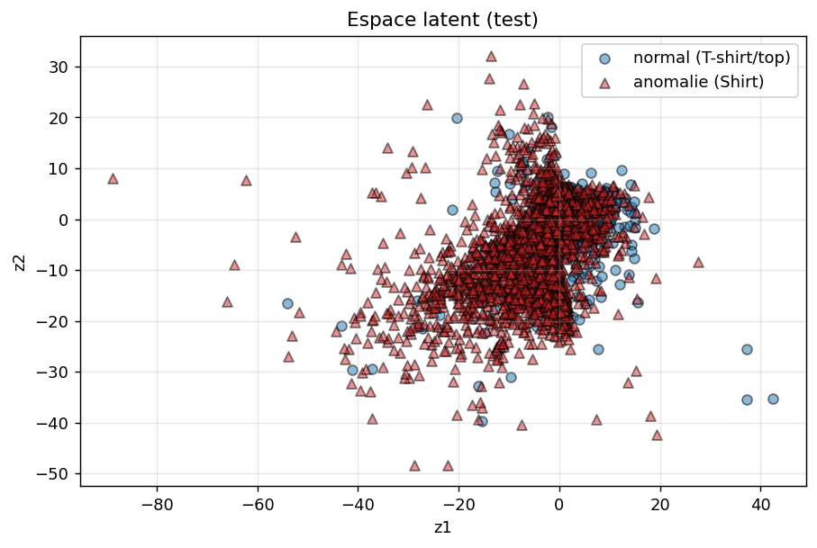
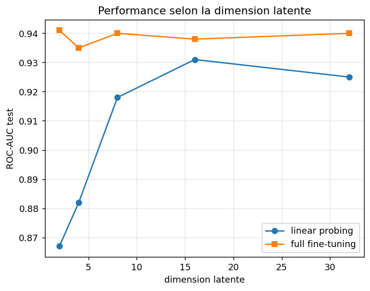
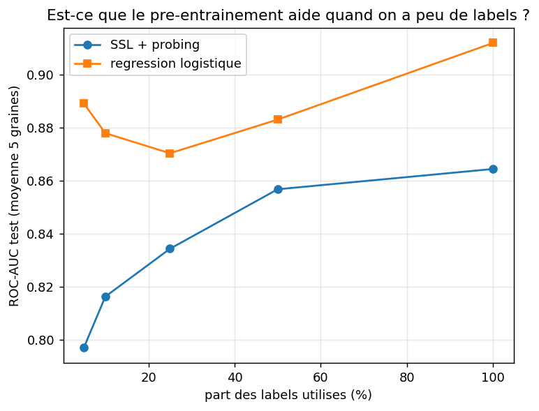
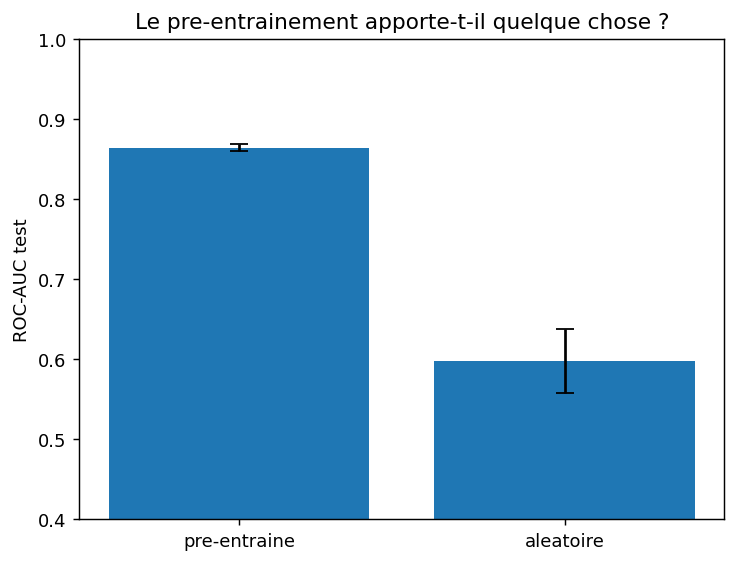
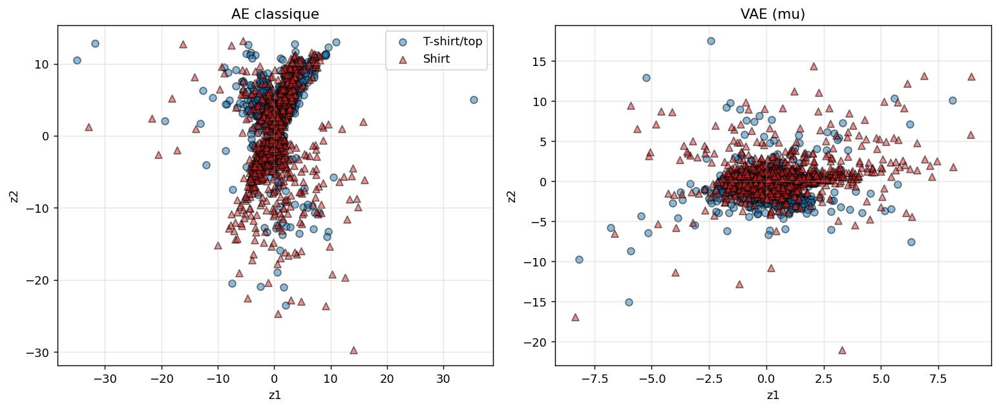

# Encodeurs et auto-encodeurs sur Fashion-MNIST : la même exploration, un dataset plus dur

*Vue d'ensemble du projet (les deux jeux de données, résultats comparés) : [`../README.md`](../README.md).*

> **En bref.** Reprise exacte des 5 notebooks du projet original (`../README.md`), mais sur
> Fashion-MNIST au lieu du cancer du sein, en gardant T-shirt/top vs Shirt, la paire de classes
> la plus confondue du dataset, pour avoir un vrai problème binaire non linéairement séparable.
> Le but : voir si les conclusions du projet original (SSL/pré-entraînement à peine utile,
> dimension latente sans effet, VAE ~ AE) tiennent quand les données sont plus dures.

**Pourquoi ce dataset.** Breast Cancer Wisconsin est petit (569 exemples) et quasi linéairement
séparable : une régression logistique y atteint déjà 0,993 de ROC-AUC, ce qui ne laisse presque
aucune place au pré-entraînement pour faire mieux. Fashion-MNIST (784 pixels, 70 000 images) n'a
pas ce problème, mais pour éviter de retomber sur un cas facile (une classe très distincte des
autres), je limite le dataset à deux classes visuellement proches : **T-shirt/top** (14 000
exemples au total avant split, servant de classe "normale" au notebook 01) et **Shirt** (la
classe la plus souvent confondue avec T-shirt/top dans la littérature Fashion-MNIST). Résultat :
un problème binaire réellement non linéaire, où une régression logistique sur pixels bruts ne
dépasse pas 0,93 de ROC-AUC (notebook 03).

**Adaptations par rapport à l'original** (le reste, méthodologie, seuils, métriques, structure
des 5 notebooks, est identique) :

- Encodeur/décodeur mis à l'échelle pour l'entrée 784 pixels : `784 → 256 → 64 → latent` au lieu
  de `30 → 14 → 6 → latent`. Tête de classification inchangée (`latent → 8 → 2`).
- `batch_size` = 128 au lieu de 64 (dataset ~15 à 25× plus gros selon le notebook).
- Chargement via `sklearn.datasets.fetch_openml("Fashion-MNIST")` au lieu de
  `load_breast_cancer()`, filtré aux deux classes retenues.
- Nombre d'époques, seeds (123), découpages train/val/test (60/20/20 pour 02/04/05, 80/20 pour
  03, 70/30 sur la classe normale pour 01) : identiques à l'original.

**Résumé des résultats (ROC-AUC test).**

| Notebook | Ce que j'explore | Résultat clé |
|---|---|---|
| `01` | Détection d'anomalies : AE entraîné sur T-shirt/top, Shirt = anomalie | **0,792** (vs 0,96 sur le cancer), l'anomalie visuellement proche est bien plus dure à détecter |
| `02` | SSL : probing vs full fine-tuning ; effet de la dimension latente | probing **0,867 → 0,931** selon le latent (2 à 16) ; full-FT stable **~0,94** |
| `03` | Baselines supervisées (pixels bruts) | régression logistique **0,928**, random forest **0,945** |
| `04` | Stabilité, efficacité en labels, ablation du pré-entraînement | stable (±0,004) ; logreg > probing latent-2 à tous les niveaux de labels ; pré-entraîné **0,864** vs aléatoire **0,598** |
| `05` | VAE vs AE classique | performances quasi identiques (**0,870** vs **0,869** en probing) ; latent VAE un peu plus resserré |

**À retenir en une phrase :** sur un problème binaire réellement non linéaire, le full
fine-tuning dépasse nettement la régression logistique (0,94 contre 0,93) et rejoint la random
forest (0,945). L'avantage du pré-entraînement que le projet original anticipait sans le voir
apparaît donc bien ici, mais seulement quand l'encodeur a soit assez de capacité latente (≥16),
soit la liberté de se réajuster en fine-tuning : un encodeur gelé trop étroit (latent 2) reste
derrière une simple régression logistique, quel que soit le nombre de labels disponibles.

---

## 1. L'auto-encodeur pour détecter des anomalies

Même protocole que l'original : l'auto-encodeur n'est entraîné que sur du "normal" (T-shirt/top),
et l'erreur de reconstruction sert de score d'anomalie pour repérer les Shirt. Sur cette paire
proche, ça marche dans le bon sens mais beaucoup plus faiblement : erreur moyenne 0,52 pour le
normal contre 1,40 pour l'anomalie, ROC-AUC 0,792 (contre ~0,96 sur le cancer). Les distributions
d'erreur se chevauchent nettement plus, logique puisque T-shirt/top et Shirt se ressemblent bien
plus qu'un tissu sain et une tumeur.

Fait notable : le seuil "calibré" (qui maximise le F1 sur une moitié de validation) dégénère ici
vers un seuil quasi nul qui classe *toute* image comme anomalie (rappel 1,0, précision nulle sur
le normal), parce que le test est très déséquilibré (77 % d'anomalies, puisque toutes les Shirt
du dataset finissent en test). Le seuil non supervisé (95e percentile) évite ce piège mais reste
modeste (F1 0,552). Contrairement à l'original, la calibration par F1 n'est donc pas toujours la
meilleure option : sur un fort déséquilibre elle peut dégénérer vers une règle triviale.

## 2. L'auto-encodeur comme pré-entraînement, puis fine-tuning

Le linear probing atteint 0,867 de ROC-AUC en latent 2 (contre 0,986 sur le cancer à la même
dimension) : la représentation apprise reste utile, mais un espace à 2 dimensions est un goulot
bien plus serré pour 784 pixels que pour 30 variables déjà redondantes. Le full fine-tuning fait
beaucoup mieux (0,941), en réentraînant tout le réseau plutôt qu'une petite tête.

Contrairement au cancer (où la dimension latente ne changeait presque rien), ici elle compte
vraiment pour le probing :

| dimension latente | probing ROC-AUC | probing F1 | full-FT ROC-AUC | full-FT F1 |
|---:|---:|---:|---:|---:|
| 2  | 0.867 | 0.798 | 0.941 | 0.869 |
| 4  | 0.882 | 0.806 | 0.935 | 0.865 |
| 8  | 0.918 | 0.835 | 0.940 | 0.877 |
| 16 | 0.931 | 0.850 | 0.938 | 0.864 |
| 32 | 0.925 | 0.845 | 0.940 | 0.870 |

Le probing grimpe fortement jusqu'à la dimension 16 puis plafonne, alors que le full fine-tuning
reste stable autour de 0,935-0,941 quelle que soit la dimension : en réentraînant tout le réseau,
il compense un goulot étroit, alors que le probing en dépend directement puisque l'encodeur est
gelé.

## 3. Les baselines supervisées

Sur pixels bruts (chaque pixel traité comme une variable indépendante, sans aucune notion de
structure d'image), les baselines sont nettement moins solides que sur le cancer : régression
logistique à 0,928 de ROC-AUC (vs 0,993), random forest à 0,945 (vs 0,997).

C'est ce qui rend la comparaison avec le SSL intéressante : contrairement au cancer, où le SSL ne
faisait que s'approcher des baselines, ici le full fine-tuning (~0,94) dépasse nettement la
régression logistique (0,928) et rejoint quasiment la random forest (0,945).

## Résultats côte à côte

Valeurs sur le jeu de test. Le ROC-AUC est la métrique principale car il ne dépend pas du seuil.

| Approche | ROC-AUC |
|---|---:|
| Random Forest (baseline supervisée) | 0.945 |
| SSL + full fine-tuning (latent 2 à 32) | ~0.94 |
| Régression logistique (baseline supervisée) | 0.928 |
| SSL + linear probing (latent 16) | 0.931 |
| SSL + linear probing (latent 2) | 0.867 |
| Auto-encodeur (détection d'anomalie) | 0.792 |

## Expériences complémentaires (notebook 04)

**Stabilité.** Sur cinq graines, les scores bougent très peu (probing 0,864 ± 0,004, full-FT
0,941 ± 0,003, tous deux en latent 2) : les écarts mesurés ailleurs sont fiables.

**Efficacité en labels.** À latent fixé à 2, la régression logistique bat le SSL + probing à
*toutes* les fractions de labels testées :

| part des labels | SSL + probing (latent 2) | régression logistique |
|---:|---:|---:|
| 5 %   | 0.797 | 0.889 |
| 10 %  | 0.816 | 0.878 |
| 25 %  | 0.834 | 0.870 |
| 50 %  | 0.857 | 0.883 |
| 100 % | 0.864 | 0.912 |

Même résultat de surface que le projet original ("la régression logistique domine"), mais pour
une raison différente. Cette étude fixe le latent à 2 (comme l'originale), et le notebook 02 a
déjà montré que c'est justement le pire cas pour le probing (0,867 en latent 2 contre 0,931 en
latent 16). Le probing perd donc ici autant à cause du goulot d'étranglement que du manque de
labels : la vraie leçon n'est pas "le pré-entraînement ne sert à rien en faible régime de
labels", mais "un encodeur gelé trop étroit ne sert à rien, quel que soit le nombre de labels".
Avec plus de capacité latente ou en fine-tuning complet, le pré-entraînement repasse devant.

**Le pré-entraînement sert-il vraiment ?** Oui, sans ambiguïté : un encodeur jamais entraîné
retombe à 0,598 ± 0,041 (proche du hasard, et bien plus instable), contre 0,864 ± 0,004 pour
l'encodeur pré-entraîné, un écart de +0,267, du même ordre que sur le cancer (+0,302).

## Un VAE pour finir (notebook 05)

Même comparaison que l'original : un VAE (reconstruction + terme KL) contre un AE classique de
même architecture. Sur l'espace latent, la différence est visible mais moins nette que sur le
cancer : le nuage du VAE reste dans [-10, 15] alors que l'AE classique étale quelques points
jusqu'à ±30, sans pour autant former un disque bien resserré autour de (0, 0), probablement parce
que les deux classes se chevauchent déjà trop pour que la régularisation KL "range" beaucoup
plus.

Côté performance, les deux se tiennent d'aussi près que sur le cancer : linear probing à 0,870
de ROC-AUC pour le VAE contre 0,869 pour l'AE, full fine-tuning à 0,945 contre 0,943. Le passage
à un dataset plus dur ne change donc pas cette conclusion précise : contrairement à l'effet de la
dimension latente ou à l'utilité du pré-entraînement, la comparaison AE/VAE reste la même que sur
le cancer, le KL ne coûte ni n'apporte grand-chose en classification pure.

## Ce que je retiens de ce deuxième passage

L'hypothèse formulée à la fin du projet original, comme quoi "l'intérêt du SSL apparaît sur des
données plus complexes", se confirme partiellement. Le full fine-tuning dépasse bien la
régression logistique ici (0,94 contre 0,93), ce qu'il ne faisait pas sur le cancer. Mais la
nuance importante, invisible sur un dataset facile, c'est que cet avantage dépend de la capacité
de l'encodeur : figé à une dimension latente de 2 (le réglage par défaut repris de l'original), le
probing reste derrière une simple régression logistique à *tous* les niveaux de labels. Il faut
soit élargir le latent (≥16), soit dégeler l'encodeur (full fine-tuning), pour que le
pré-entraînement paie. Sur un dataset facile comme le cancer, cette distinction ne se voyait pas
parce que la dimension latente n'avait quasiment aucun effet. C'était justement la conclusion
originale à tester, et Fashion-MNIST la contredit clairement.

Autre enseignement : la détection d'anomalies par reconstruction (notebook 01) dépend beaucoup de
la proximité entre la classe normale et l'anomalie, ce qui semble évident mais se retrouve bien
chiffré ici (0,96 vs 0,79 de ROC-AUC selon que l'anomalie est une tumeur ou un vêtement
visuellement proche). Le choix du seuil est aussi plus fragile qu'il n'y paraît sur un jeu
déséquilibré, où maximiser le F1 en validation peut dégénérer vers une règle triviale.
